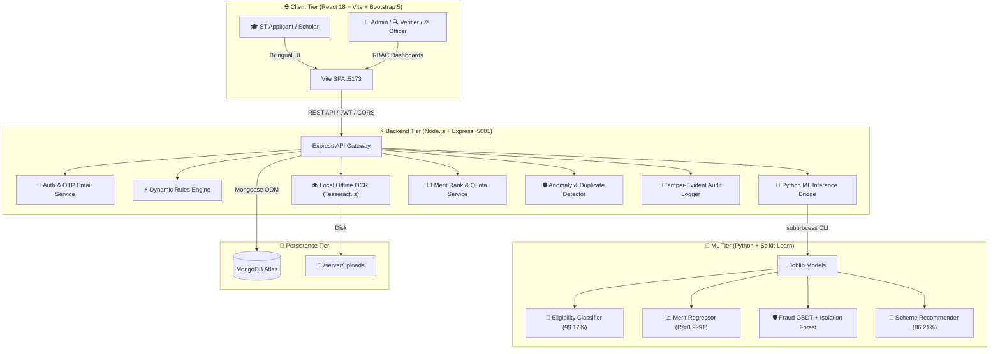

<div align="center">

# 🏛️ AI-Enabled Scholarship & Fellowship Management System

### **Smart India Hackathon 2026 | Problem Statement ID: 26239**
#### **Ministry of Tribal Affairs (MoTA), Government of India**

[](https://www.sih.gov.in/)
[](https://tribal.nic.in/)
[](https://reactjs.org/)
[](https://nodejs.org/)
[](https://www.mongodb.com/)
[](https://scikit-learn.org/)
[](https://tesseract.projectnaptha.com/)

> **"Empowering Scheduled Tribe (ST) Scholars through AI-Assisted Transparent Governance, Local Document Intelligence, and Automated Merit Delivery."**

---

[🌟 Problem & Solution](#-the-problem--our-solution) •
[🏗️ Architecture](#-system-architecture) •
[🤖 Machine Learning](#-machine-learning-pipeline) •
[🔍 Verification Pipeline](#-document-verification--mismatch-pipeline) •
[🛠️ Tech Stack](#-tools--technologies-used) •
[📁 Project Structure](#-project-structure) •
[📜 5 Official Schemes](#-the-5-official-mota-schemes) •
[👥 Role Workflows](#-the-four-operational-roles) •
[⚡ Quick Start](#-local-quick-start)

</div>

---

## 🌟 The Problem & Our Solution

### 🚩 The Real-World Problem

The **Ministry of Tribal Affairs (MoTA)** administers national higher education and research fellowships for Scheduled Tribe (ST) students across India. The scholarship lifecycle historically suffered from critical friction points:

1. **Massive Processing Delays** — Manual physical paper verification and siloed state workflows created 3–6 month backlogs before scholars received disbursements.
2. **Document Forgery & Exploitation** — Tampered income or caste certificates and duplicate applications across multiple states were used to claim double benefits.
3. **Rigid Hardcoded Rules** — Changes to scheme policies (income ceilings, quota thresholds) required backend code redeployment and system downtime.
4. **Officer Overburden** — Scrutiny officers manually compared 20+ fields per application against uploaded document PDFs.
5. **Language & Information Barrier** — Rural ST scholars lacked instant pre-check guidance to determine their scheme eligibility.

---

### 💡 Our End-to-End Solution

An **AI-Assisted, Human-in-the-Loop Architecture** that modernizes the entire scholarship governance pipeline:

| Problem | Our Solution | Impact |
|:---|:---|:---|
| Months of manual verification | 100% Offline AI OCR (Tesseract.js + pdf-parse) | Instant entity extraction, ~85% less manual effort |
| Document forgery & duplicates | SHA-256 Binary Hashing + Isolation Forest Anomaly Detection | 100% ROC-AUC fraud detection |
| Hardcoded policy logic | Dynamic Rule Builder stored as data in MongoDB | Zero-downtime policy updates |
| Complex slot allocation | Multi-Criteria ML Merit Regressor (R² = 0.9991) | Automated All-India rank with 30% Women + 5% PwD quotas |
| Student uncertainty | Instant Zero-Login Pre-Check + Multi-Class Scheme Recommender | Instant pass/fail feedback |

---

## 🏗️ System Architecture



---

## 🤖 Machine Learning Pipeline

### Why Machine Learning?

- **Multi-dimensional ranking** — Deterministic rules cannot rank thousands of applicants across competing variables (NIRF ranks, GPA, economic need, quotas).
- **Unsupervised fraud detection** — Detects non-linear fraud signatures like income-asset discrepancies, statistical outliers in marks, and duplicate certificate reuse.
- **Sub-10ms inference** — Triages applications automatically so human officers focus scrutiny on high-risk or borderline cases.

### The 4 Trained Models

Trained on **12,000+ synthetic records** modelled directly on official MoTA gazette guidelines:

```
ml/
├── models/
│   ├── eligibility_classifier.joblib     # RandomForest — 99.17% Accuracy
│   ├── merit_regressor.joblib            # GradientBoosting — R² = 0.9991
│   ├── fraud_classifier.joblib           # GBDT Classifier — 100% ROC-AUC
│   ├── isolation_forest.joblib           # Unsupervised Anomaly Detector
│   ├── scheme_recommender.joblib         # Multi-Class RF — 86.21% Accuracy
│   ├── scholarship_encoders.joblib       # Label encoders
│   ├── scholarship_scaler.joblib         # Feature scaler
│   └── feature_importance.json          # XAI feature weights
```

| Model | Algorithm | Metric | Purpose |
|:---|:---|:---:|:---|
| **Eligibility Classifier** | RandomForestClassifier (120 est., depth=12) | **99.17%** | Classifies into `Eligible`, `Borderline`, `Ineligible` |
| **Merit Regressor** | GradientBoostingRegressor (150 est., lr=0.08) | **R²=0.9991** | Composite merit score (0–100) + All-India percentile |
| **Fraud Detector** | Supervised GBDT + Unsupervised IsolationForest | **100% ROC-AUC** | Detects certificate tampering, duplicate hashes, ratio anomalies |
| **Scheme Recommender** | Multi-Class RandomForestClassifier (80 est.) | **86.21%** | Best-fit MoTA scholarship scheme recommendation |

> 🔒 **Admin ML Hub:** Ministry Administrators access `/ml-hub` to test live ML inference sliders and inspect feature importance breakdowns in real time.

---

## 🔍 Document Verification & Mismatch Pipeline

```
 Applicant Submits       Offline OCR            Automated Mismatch       Verifier Queue
   Application    ───►   Extraction      ───►    Engine Check     ───►   Inspection
                              │                        │                      │
                         SHA-256 Hash            Cross-field checks      Side-by-side
                           stored                (Name, Income, ST)      doc preview
                                                                               │
   DBT Disbursed       Admin Publishes        Scrutiny Officer       Verifier Decision
   & Confirmed    ◄───   Merit List     ◄───  Signed Assessment ◄── (Approve/Reject/
                                                                       Raise Deficiency)
```

**Verification Steps:**
1. **Upload & Hash** — SHA-256 cryptographic hash stored per file to guarantee uniqueness and prevent re-upload of stolen documents.
2. **Local OCR** — `Tesseract.js` + `pdf-parse` extracts text entities (Certificate ID, Issuing Authority, Caste Category, Income, Name) 100% locally — no cloud APIs.
3. **Cross-Field Mismatch Detection** — Fuzzy string similarity on names, income threshold validation, caste verification. Discrepancies logged in `mismatchSchema`.
4. **Verifier Queue** (`/verifier/queue`) — Side-by-side preview, OCR confidence scores, Approve / Reject / Deficiency.
5. **Scrutiny Officer** (`/officer/scrutiny`) — Reviews verified dossier + ML score, records signed justification in the Tamper-Evident Audit Log.
6. **Merit Publishing & DBT** — Admin applies 30% Women + 5% PwD quotas, publishes final merit list for Direct Benefit Transfer.

---

## 🛠️ Tools & Technologies Used

```
┌──────────────────────────┬────────────────────────────┬──────────────────────────┐
│  FRONTEND                │  BACKEND & API             │  DATA & PERSISTENCE      │
│  • React 18 (Vite SPA)   │  • Node.js v18+            │  • MongoDB Atlas / Local │
│  • React-Bootstrap 5     │  • Express.js REST API     │  • Mongoose ODM          │
│  • Vanilla CSS Tokens    │  • JWT Authentication      │  • 10 Mongoose Models    │
│  • Lucide React Icons    │  • Bcrypt.js Password Hash │  • Structured Sub-docs   │
│  • Chart.js / react-     │  • Nodemailer (OTP Email)  │  • JSON Seed Data        │
│    chartjs-2             │  • Multer (File Uploads)   │                          │
│  • canvas-confetti       │  • Morgan (Request Logger) │                          │
│  • React Router v7       │  • node:crypto (OTP Gen)   │                          │
├──────────────────────────┼────────────────────────────┼──────────────────────────┤
│  AI, OCR & ML            │  SECURITY & COMPLIANCE     │  DEVOPS & INFRA          │
│  • Python 3.10+          │  • SHA-256 Binary Hashing  │  • Docker + Compose      │
│  • Scikit-Learn          │  • 4-Tier RBAC Guards      │  • Nginx Reverse Proxy   │
│  • Pandas & NumPy        │  • Immutable Audit Trails  │  • Terraform (AWS IaC)   │
│  • Joblib Serialization  │  • Rate Limiting           │  • GitHub Actions CI/CD  │
│  • Tesseract.js (OCR)    │  • Private .env Isolation  │  • Let's Encrypt SSL     │
│  • pdf-parse             │  • Human-in-the-Loop AI    │  • node --watch (dev)    │
│  • mongodb-memory-server │  • Email OTP Verification  │  • Vite Build            │
│    (testing)             │                            │                          │
└──────────────────────────┴────────────────────────────┴──────────────────────────┘
```

---

## 📁 Project Structure

```
tribal-scholar/
│
├── client/                          # React 18 + Vite Frontend (SPA)
│   ├── public/
│   │   └── images/hero/             # Hero section images
│   └── src/
│       ├── api/
│       │   └── axiosClient.js       # Axios instance with JWT interceptor
│       ├── components/
│       │   ├── common/              # Button, FormField, SelectField,
│       │   │                        # PageHeader, EmptyState, ErrorState,
│       │   │                        # LoadingSkeleton, ConfirmationDialog
│       │   ├── kisan/               # HeroCommandCenter (admin hero)
│       │   ├── AppShell.jsx         # Page layout wrapper
│       │   ├── ChatWidget.jsx       # Gemini AI chat assistant
│       │   ├── DataTable.jsx        # Reusable sortable table
│       │   ├── DocumentUploader.jsx # Multi-file upload with OCR trigger
│       │   ├── EligibilityResultCard.jsx
│       │   ├── EligibilitySummary.jsx
│       │   ├── GovernmentBar.jsx    # MoTA top government bar
│       │   ├── MainNavbar.jsx       # Primary navigation bar
│       │   ├── NotificationBell.jsx # Real-time notification bell
│       │   ├── OcrResultCard.jsx    # OCR extraction display
│       │   ├── SchemeCard.jsx       # Scheme listing card
│       │   ├── Sidebar.jsx          # Role-specific dashboard sidebar
│       │   ├── StatusBadge.jsx      # Application status indicator
│       │   └── Timeline.jsx         # Application lifecycle timeline
│       ├── context/
│       │   ├── AuthContext.jsx      # JWT auth state + login/register/OTP
│       │   └── LanguageContext.jsx  # Hindi/English i18n context
│       ├── pages/
│       │   ├── public/              # Home, Login, Register, VerifyOtp,
│       │   │                        # EligibilityChecker, SchemeList,
│       │   │                        # SchemeDetail, MachineLearningHub
│       │   ├── applicant/           # ApplicantDashboard, NewApplication,
│       │   │                        # MyApplications, ApplicationDetail,
│       │   │                        # DeficiencyInbox, MyFellowship,
│       │   │                        # Notifications, Profile, RecommendedSchemes
│       │   ├── admin/               # AdminDashboard, UserManagement,
│       │   │                        # RuleBuilder, SchemeBuilder,
│       │   │                        # AuditLog, Anomalies, Reports
│       │   ├── verifier/            # VerifierQueue, ReviewApplication,
│       │   │                        # FlaggedDocuments
│       │   └── officer/             # OfficerScrutiny, MeritList,
│       │                            # FellowshipPayments, SelectionWorkflow
│       ├── index.css                # Civic design system (CSS tokens)
│       └── App.jsx                  # Route definitions (React Router v7)
│
├── server/                          # Node.js + Express Backend
│   ├── src/
│   │   ├── config/
│   │   │   ├── db.js                # MongoDB connection (Atlas / local fallback)
│   │   │   └── env.js               # dotenv loader
│   │   ├── controllers/             # authController, applicationController,
│   │   │                            # schemeController, documentController,
│   │   │                            # eligibilityController, verifierController,
│   │   │                            # officerController, adminController,
│   │   │                            # disbursementController, dashboardController
│   │   ├── middleware/
│   │   │   ├── auth.js              # JWT verify + RBAC protect
│   │   │   ├── errorHandler.js      # Global error handler
│   │   │   ├── rateLimit.js         # Rate limiting middleware
│   │   │   └── upload.js            # Multer config (PDF/Image)
│   │   ├── models/
│   │   │   ├── Application.js       # Application lifecycle + status
│   │   │   ├── AuditLog.js          # Tamper-evident immutable log
│   │   │   ├── Counter.js           # Auto-increment ID counter
│   │   │   ├── Deficiency.js        # Verifier-raised deficiency notices
│   │   │   ├── Disbursement.js      # DBT payment records
│   │   │   ├── Document.js          # Uploaded doc + OCR + hash
│   │   │   ├── Notification.js      # In-app notification records
│   │   │   ├── Scheme.js            # Scholarship scheme definitions
│   │   │   ├── User.js              # User + hashed password + OTP
│   │   │   └── VerificationLog.js   # Per-doc verifier decisions
│   │   ├── routes/                  # authRoutes, applicationRoutes,
│   │   │                            # documentRoutes, schemeRoutes, etc.
│   │   ├── seed/
│   │   │   ├── seed.js              # Full database seeder (users + schemes)
│   │   │   ├── schemes.js           # All 5 official MoTA scheme definitions
│   │   │   └── ensureSchemes.js     # Upsert schemes on server start
│   │   ├── services/
│   │   │   ├── emailService.js      # Nodemailer OTP email delivery
│   │   │   ├── meritService.js      # Merit score + quota calculation
│   │   │   ├── mlService.js         # Python subprocess ML inference bridge
│   │   │   ├── notificationService.js
│   │   │   ├── ocrService.js        # Tesseract.js + pdf-parse extraction
│   │   │   ├── recommendService.js  # Scheme recommendation logic
│   │   │   ├── reminderService.js   # Hourly background reminder jobs
│   │   │   └── rulesEngine.js       # Dynamic eligibility rules evaluator
│   │   ├── app.js                   # Express app setup (CORS, middlewares)
│   │   └── server.js                # Entry point — DB connect + listen
│   ├── scripts/
│   │   ├── dev-local.js             # Local MongoDB dev runner
│   │   └── seed-schemes.js          # Standalone scheme seeder script
│   ├── test/
│   │   └── api.test.js              # Node built-in test runner API tests
│   └── .env                         # Environment variables (not committed)
│
├── ml/                              # Python ML training & inference
│   ├── models/
│   │   ├── eligibility_classifier.joblib
│   │   ├── merit_regressor.joblib
│   │   ├── fraud_classifier.joblib
│   │   ├── isolation_forest.joblib
│   │   ├── scheme_recommender.joblib
│   │   ├── scholarship_encoders.joblib
│   │   ├── scholarship_scaler.joblib
│   │   └── feature_importance.json
│   ├── data/                        # Training datasets
│   └── scripts/                     # Model training scripts
│
├── nginx/                           # Nginx reverse proxy config
├── terraform/                       # AWS infrastructure as code (IaC)
├── .github/                         # GitHub Actions CI/CD workflows
├── docker-compose.prod.yml          # Production Docker Compose stack
└── .gitignore
```

---

## 📜 The 5 Official MoTA Schemes

All five official scholarship & fellowship programmes administered by the Ministry of Tribal Affairs:

| Code | Scheme Name | Level & Scope | Financial Benefits | Seats |
|:---:|:---|:---|:---|:---:|
| **`ARG45`** | National Fellowship for ST Students (NFST) | M.Phil & Ph.D. in IITs, NITs, IISc | JRF/SRF fellowship (UGC norms) + ₹20,800/yr contingency + HRA | **750** *(30% Women)* |
| **`AZKMI`** | National Overseas Scholarship (NOS) | Master's & Ph.D. — Top 500 QS World Universities | 100% Tuition + $15,400 USD / £9,900 GBP living allowance + Airfare | **20** *(Income ≤ ₹6L)* |
| **`A023B`** | Top Class Education for ST Students | UG/PG — 265+ Premier Institutes (IIT, IIM, AIIMS, NLU) | Full fees + ₹3,000/mo boarding + ₹45,000 computer grant | Notified institutes |
| **`BVOBC`** | Post-Matric Scholarship for ST Students | Class 11, 12, Degree, Diploma, Medical, Engineering | DBT tuition fees + monthly maintenance allowance | Pan-India |
| **`BPVGK`** | Pre-Matric Scholarship for ST Students | Class 9th & 10th Secondary Students | ₹3,500–₹7,000/yr DBT stipend | Pan-India |

---

## 👥 The Four Operational Roles

```
🎓 APPLICANT (ST Scholar)     🔍 DOCUMENT VERIFIER        ⚖️ SCRUTINY OFFICER         👑 MINISTRY ADMIN
──────────────────────────    ──────────────────────       ───────────────────         ─────────────────
• Pre-check eligibility       • Verifier queue review      • Scrutiny dashboard        • Executive KPIs
• Submit applications         • OCR confidence inspect     • Formal determination      • Dynamic Rule Builder
• Upload documents            • Raise deficiency notices   • Written justification     • Scheme Builder
• Resolve deficiency inbox    • Approve / Reject docs      • Merit recommendation      • Publish Merit Lists
• Track fellowship & DBT      • Flag mismatches            • Flag fraud cases          • Anomaly Dashboard
• View recommended schemes    • Flagged documents queue    • Fellowship payments       • User Management
• Notification bell           •                            • Selection workflow        • ML Intelligence Hub
                                                                                       • Audit Log viewer
                                                                                       • Reports
```

---

## ⚡ Local Quick Start

### Prerequisites

| Tool | Version |
|:---|:---|
| Node.js | v18.0.0 or higher |
| MongoDB | Local (port 27017) **or** MongoDB Atlas URI |
| Python | 3.10+ (for ML inference scripts) |
| npm | v9+ |

---

### Step 1 — Clone & Configure

```bash
git clone https://github.com/Dhruta25/Tribal-scholarship.git
cd Tribal-scholarship
```

**Configure server environment:**
```bash
cp server/.env.example server/.env
# Edit server/.env and fill in your values:
```

```env
PORT=5001
MONGODB_URI=mongodb://127.0.0.1:27017/sih_scholarship   # or Atlas URI
JWT_SECRET=your_strong_jwt_secret_here
JWT_EXPIRE=7d
NODE_ENV=development
CLIENT_URL=http://localhost:5173

# Email / OTP — set OTP_DELIVERY=development to show OTP on screen (no email needed)
OTP_DELIVERY=development
EMAIL_USER=your-email@gmail.com
EMAIL_PASS=your-16-char-gmail-app-password
```

**Configure client environment:**
```bash
cp client/.env.example client/.env
# client/.env:
# VITE_API_URL=http://localhost:5001/api
```

---

### Step 2 — Backend

```bash
cd server

# Install dependencies
npm install

# Seed database (5 schemes + demo user accounts)
npm run seed

# Start development server (auto-restarts on file changes)
npm run dev
# → API running at http://localhost:5001/api
```

---

### Step 3 — Frontend

```bash
# Open a new terminal
cd client

# Install dependencies
npm install

# Start Vite dev server
npm run dev
# → App running at http://localhost:5173
```

Open **http://localhost:5173** in your browser.

---

### Step 4 — ML Models (Optional)

The ML models (`.joblib`) are pre-trained and committed. To retrain:

```bash
cd ml
pip install scikit-learn pandas numpy joblib
python scripts/train_models.py
```

---

## 🔑 Demo Credentials (After Seeding)

Run `npm run seed` inside `server/` first. The following accounts are created:

| Role | Email | Password |
|:---|:---|:---|
| 👑 Ministry Admin | `admin@mota.gov.in` | `Admin@123` |
| 🔍 Document Verifier | `verifier1@mota.gov.in` | `Verifier@123` |
| ⚖️ Scrutiny Officer | `officer1@mota.gov.in` | `Officer@123` |
| 🎓 ST Scholar (Applicant) | `rahul.st@example.com` | `Applicant@123` |

---

## 🛡️ Security & Responsible AI

- **Human-in-the-Loop AI** — AI models extract, flag, and score — but all final scholarship grants and rejections require a human officer's signed determination.
- **Immutable Audit Logging** — Every status change, override, and document decision is permanently logged with timestamp, actor ID, IP address, and stated reason.
- **No External Cloud Leaks** — OCR and ML run 100% locally. Student certificates and personal data are never sent to third-party commercial AI APIs.
- **Strict Environment Isolation** — All secrets and database URIs are stored in unversioned `.env` files excluded by `.gitignore`.
- **Rate Limiting** — API endpoints are rate-limited to prevent brute-force and denial-of-service attacks.
- **Email OTP Verification** — New accounts require email-verified OTP before login is permitted.

---

<div align="center">

**Smart India Hackathon 2026 — Problem Statement ID: 26239**
*Ministry of Tribal Affairs (MoTA), Government of India*

</div>
